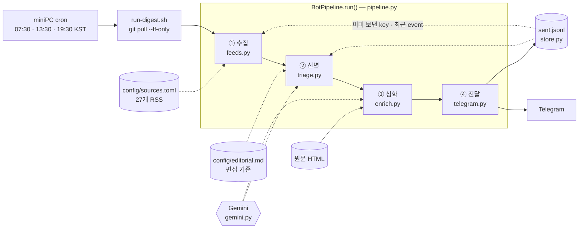

# AI Trend Bot

AI 관련 소식을 모아 한국어로 요약하고 텔레그램으로 보내는 개인용 봇입니다.

설계 배경과 결정 근거는
[`docs/superpowers/specs/2026-08-03-digest-quality-overhaul-design.md`](docs/superpowers/specs/2026-08-03-digest-quality-overhaul-design.md)에 있습니다.

## 구조



- **상태는 `sent.jsonl` 한 파일뿐입니다.** DB도 캐시도 큐도 없습니다. 이 파일이 수집 단계의
  중복 제거와 선별 단계의 "후속 보도인가" 판정을 동시에 먹입니다.
- **Gemini는 두 단계에서 다르게 씁니다.** ②는 수백 건을 훑는 심사, ③ 뒤의 요약은 통과한
  소수만 대상입니다. 비용이 감당되는 이유가 이 순서입니다.
- **점선은 읽기, 실선은 흐름입니다.** 점선 입력을 고치는 것이 코드를 고치는 것보다 먼저입니다
  — 특히 `editorial.md`.
- 모든 네트워크 호출은 `asyncio.gather`로 병렬입니다. 소스 하나가 죽으면 그 소스만
  경고로 빠지고 브리핑은 나갑니다.

| 모듈 | 역할 |
| --- | --- |
| `pipeline.py` | 4단 조립. 여기만 읽으면 전체 흐름이 보입니다 |
| `feeds.py` | RSS 수집·정규화 |
| `triage.py` | LLM 판정 적용 — 분류·사건 병합·순위. **순수 함수라 LLM 없이 테스트됩니다** |
| `gemini.py` | 유일한 LLM 경계. 선별·요약 프롬프트와 타임아웃 |
| `enrich.py` | `trafilatura`로 원문 본문 추출, 실패 시 RSS 티저 폴백 |
| `telegram.py` | HTML 렌더링·4,096자 분할·전송 |
| `store.py` | `SentLog`. JSONL 읽고 쓰기 |
| `config.py` | `sources.toml` 파싱·검증 |
| `cli.py` | Typer 진입점. `check-config`, `run` |

## 운영 기준

- 발송: 매일 07:30, 13:30, 19:30 (Asia/Seoul). **miniPC의 cron이 실행합니다**
- 중복 게시물은 다시 보내지 않음
- 현재 운영 모드: RSS 뉴스 중심
- 발송 개수는 **가변**입니다. 편집 기준을 통과한 것만 보내며, 통과분이 없으면 보내지 않습니다.
  `--limit`(기본 30, 최대 40)은 목표치가 아니라 폭주 방지선입니다.

**GitHub Actions는 더 이상 예약 실행하지 않습니다.** `schedule`이 best-effort 큐라서
2026-08-05~07 관측 기준 +63~193분 지연이 일상이었고, 지연이 다음 슬롯까지 밀리면 아예
버려졌습니다. 아침 브리핑이 점심에 오는 것이 정상 상태였습니다. 2026-08-07에 실행을
miniPC로 옮겼고 근거는
[`docs/superpowers/specs/2026-08-07-minipc-execution-design.md`](docs/superpowers/specs/2026-08-07-minipc-execution-design.md)에 있습니다.

`--min-gap-hours 3`은 유지합니다. cron이 어떤 이유로 두 번 발사되어도 두 번째 브리핑이
나가지 않게 막습니다. 후보가 "지난 실행 이후 새로 올라온 것"이 아니라 **"아직 안 보낸 것
전부"**여서, 이 가드가 없으면 재실행이 매번 상위 몇 건을 또 골라 보냅니다. 정규 회차는
6시간 간격이라 이 가드에 걸리지 않습니다.

한 회차를 통째로 놓쳐도 항목이 사라지지는 않습니다. 중복 판정이 시각이 아니라 URL
기준이라, 다음 회차가 그대로 후보로 잡습니다.

## miniPC 실행

정규 발송은 miniPC에서 돕니다. GitHub은 코드를 받아오는 창구로만 씁니다.

| 위치 | 무엇 |
| --- | --- |
| `~/apps/ai-trend-bot` | clone. 읽기 전용 |
| `~/.ssh/ai-trend-bot` | read-only deploy key. `~/.ssh/config`의 `github-ai-trend-bot` 별칭이 씁니다 |
| `~/.config/ai-trend-bot.env` | 시크릿 3개 (0600) |
| `~/bin/run-digest.sh` | `scripts/run-digest.sh` 사본 |
| `~/.local/state/ai-trend-bot/sent.jsonl` | 발송 기록. 저장소 밖 |
| `~/logs/ai-trend-bot.log` | 실행 결과 |

```bash
crontab -l                          # 30 7,13,19 * * * ~/bin/run-digest.sh ...
tail -5 ~/logs/ai-trend-bot.log     # 회차마다 "<시각> done"
```

실측 기준 한 회차가 **80초, 최대 RSS 96MB, CPU 5%**이고 설치 용량은 약 436MB입니다.
상시 실행되는 프로세스는 없습니다.

코드를 고쳤으면 `main`에 머지만 하면 됩니다. 스크립트가 실행 전에 `git pull --ff-only`를 합니다.
`scripts/run-digest.sh` 자체를 고쳤을 때만 `~/bin/`으로 다시 복사해야 합니다.

miniPC가 죽으면 그 회차는 오지 않습니다. GitHub Actions에서 `workflow_dispatch`를 수동으로
누르면 보낼 수 있지만, 그쪽은 저장소의 오래된 `data/sent.jsonl`을 보므로 **중복이 갈 수 있습니다.**

## 브리핑이 안 왔을 때

miniPC의 로그부터 봅니다. GitHub Actions는 이제 관계가 없습니다.

```bash
ssh miniPC 'tail -20 ~/logs/ai-trend-bot.log'
```

- **해당 회차 줄이 아예 없다** → cron이 안 돈 것. 아래 표의 1~3번
- **줄은 있는데 `done`이 없다** → 실행 중 죽은 것. 4~6번
- **`done`은 있는데 텔레그램이 조용하다** → 7번. 대개 정상입니다

| # | 원인 | 확인·대응 |
| --- | --- | --- |
| 1 | miniPC 다운·재부팅 | `ssh miniPC uptime`. 그 회차는 오지 않습니다. 복구 후 `~/bin/run-digest.sh`를 직접 돌리면 됩니다 |
| 2 | crontab 유실 | `ssh miniPC crontab -l`에 `30 7,13,19` 줄이 있는지 |
| 3 | cron 서비스 정지 | `systemctl is-active cron` |
| 4 | 시크릿 파일 문제 | `ls -l ~/.config/ai-trend-bot.env`가 0600인지. 값이 틀리면 텔레그램 401이 로그에 남습니다 |
| 5 | Gemini 5xx·429 | 로그에 `외부 API 오류: HTTP <코드>`. 재시도 세 번 뒤에도 실패한 경우입니다 |
| 6 | `설정 파일을 찾을 수 없습니다` | 스크립트의 `cd "$REPO"`가 빠진 것. `sources.toml`은 CWD 상대 경로로 열립니다 |
| 7 | 편집 기준 통과 0건 | 로그에 `기준을 통과한 항목이 없습니다`. 보낼 게 없으면 보내지 않습니다 |

`git pull 실패`가 로그에 있어도 발송 자체는 진행됩니다. 그 회차는 이전 코드로 돈 것입니다.

**어느 경우든 항목이 사라지지는 않습니다.** 중복 판정이 시각이 아니라 URL 기준이라,
한 회차를 통째로 놓쳐도 다음 회차가 그대로 후보로 잡습니다. 그날은 평소보다 많이 옵니다.

## 데이터 저장

발송한 항목을 JSONL로 한 줄씩 기록합니다. **이 파일 하나가 유일한 상태입니다.** DB도 캐시도 없습니다.

```jsonc
{"key": "<URL의 sha256>", "title": "...", "url": "...", "source": "...", "category": "...", "event": "...", "sent_at": "..."}
```

경로는 `AI_TREND_BOT_SENT_LOG`로 정하고, 값이 없으면 `data/sent.jsonl`로 떨어집니다.
**miniPC는 `~/.local/state/ai-trend-bot/sent.jsonl`을 씁니다.** clone을 읽기 전용으로 유지하려는
것입니다. 저장소의 `data/sent.jsonl`은 2026-08-07 이관 시점 스냅샷이며 더는 갱신되지 않습니다.

세 곳에서 읽습니다. 중복 방지 로그이면서 요약 품질에도 물려 있습니다.

| 읽는 곳 | 범위 | 없으면 |
| --- | --- | --- |
| `unseen()` | 전 기간의 `key` | 이미 보낸 항목을 다시 보냅니다 |
| `last_sent_at()` | 마지막 1줄 | 회차 중복 방지가 풀립니다 |
| `recent_events(days=14)` | 최근 14일의 `event` | triage가 후속 보도를 새 소식으로 봅니다 |

- 기록은 텔레그램 메시지 하나가 실제로 전달된 뒤에만 남습니다. 여러 메시지로 쪼개져 나가다
  중간에 실패해도, 이미 도착한 것은 다시 오지 않습니다.
- 이전에는 SQLite 파일을 GitHub Actions 캐시에 두었으나, 캐시는 7일 미사용·용량 초과로
  evict되며 그때마다 대량 재발송이 발생합니다. 그래서 파일로 옮겼습니다.
- 실측 407B/줄, 하루 약 24줄, **연 3.4MB**입니다. 가지치기는 없습니다. 커지면 오래된 줄부터
  잘라내면 됩니다.
- 백업은 두지 않습니다. 날아가면 중복 브리핑이 한 번 가고 2주간 triage 맥락이 비지만,
  둘 다 자가 복구됩니다.

탈락 항목과 그 사유는 파일로 저장하지 않고 **매 회차 표준 출력에 찍습니다**
(`--show-dropped`, 기본 켜짐). 드라이런은 두 시간만 지나도 다른 후보 집합을 보므로,
"이 브리핑이 무엇을 버렸는가"는 그 회차 자신만 답할 수 있습니다. miniPC에서는
cron이 `~/logs/ai-trend-bot.log`에 이어 붙이므로 며칠이면 분포가 쌓입니다.

## 설정

수집처는 `config/sources.toml`에서 관리합니다.

```bash
uv sync
uv run ai-trend-bot check-config
uv run ai-trend-bot run --dry-run --limit 30   # 발송 없이 결과만 확인
uv run ai-trend-bot run --send --limit 30      # 실제 발송
```

`TELEGRAM_BOT_TOKEN`, `TELEGRAM_CHAT_ID`, `GEMINI_API_KEY`가 필요합니다. miniPC는
`~/.config/ai-trend-bot.env`에서, 로컬에서는 `.env.example`을 `.env`로 복사해 읽습니다.
수동 `workflow_dispatch`를 쓰려면 GitHub Actions Secrets에도 같은 값이 있어야 합니다.
**발급받은 키를 채팅이나 저장소에 직접 올리지 마세요.**

수동 실행 시 `data/sent.jsonl`을 푸시하므로 워크플로에 `contents: write` 권한이 필요합니다.

## 파이프라인

네 단계의 그림은 [위 구조](#구조)에 있습니다. 여기서는 각 단계가 왜 그렇게 생겼는지를 씁니다.

**②가 핵심입니다.** 항목마다 종류를 매기고(`모델·제품 출시`, `연구 결과`, `정책·산업·자금`,
`도구·오픈소스`, `튜토리얼·사용법`, `홍보·사례소개`, `기타`) 뒤 세 종류는 코드에서 강제로
버립니다. 0~100 점수에 임계값을 걸지 않는 이유는, 모델의 절대 점수가 좁은 구간에 몰려서
어디를 자르든 자의적이 되기 때문입니다. 순위도 절대 평가가 아니라 후보끼리 비교해 매깁니다.

**③이 요약 품질을 좌우합니다.** 예전에는 RSS의 두세 문장짜리 티저를 요약해서 "요약본의
요약"이 나왔습니다. 이제 통과한 소수만 원문 본문을 받아옵니다. 추출에 실패하면 티저로
폴백하므로 그 항목만 얕아지고 발송은 정상 진행됩니다.

**②는 두 번 돌립니다.** 무료 티어 Gemini는 후보 300건대를 한 요청으로 받으면 503을
반환합니다. 그래서 1차는 100건씩 배치로 심사합니다. 다만 배치만 나누면 같은 사건을
다룬 두 매체가 서로 다른 배치에 떨어져 둘 다 살아남습니다. 그래서 1차 생존자
수십 건을 다시 한 번에 놓고 중복 병합과 순위를 다시 매깁니다.

**두 라운드는 서로 다른 질문을 던집니다.** 1차는 "이 항목이 보낼 가치가 있나"를 항목별로
묻습니다. 수백 건을 훑을 때는 이게 맞는 질문입니다. 2차에 같은 질문을 또 하면, 이미 1차를
통과한 것들은 개별로 보면 다 그럴듯해서 거의 전부 재승인됩니다. 그래서 2차는
**"오늘 실을 것을 고른다"**로 틀을 바꿉니다 — 한 회차는 보통 3~8건이고, 서로 비교해
약한 것과 같은 사건의 다른 측면은 떨어뜨리라고 지시합니다.

실측:

| 시점 | 후보 | 발송 | 비고 |
| --- | --- | --- | --- |
| 로컬 (수정 전) | 322 | 7 | |
| Actions (수정 전) | 311 | **30** | 상한에 걸림. 2차가 재승인만 함 |
| 로컬 (수정 후) | 286 | 14 | |

**발송량은 회차마다 흔들립니다.** 2차를 선별로 바꿔 최악(상한 도달)은 잡았지만, LLM
판단이라 편차가 남습니다. 계속 많다고 느끼면 아래 편집 기준을 조이면 됩니다.

## 브리핑 형식

```
🌅  AI 트렌드 브리핑 · 아침 07:30        ← "AI 트렌드 브리핑"만 굵게
8월 3일 (월) · 3건

────────────────

01. 앤스로픽, 자동화 에이전트 'Cowork' 출시   ← 줄 전체 굵게
[모델·제품 출시]

핵심: Claude Desktop에서 파일을 직접 다루는 에이전트를 공개했습니다.
왜 중요한가: 작업 범위가 채팅창 밖으로 넓어집니다.
관련 대상: Claude Desktop 사용자

↳ 원문: VentureBeat AI                    ← 매체명에 기사 링크
```

- 상단 이모지는 회차별로 바뀝니다: 아침 🌅 / 점심 ☀️ / 저녁 🌙
- 병합된 사건은 `↳ 원문: Hacker News (AI) · TechCrunch`처럼 링크가 나란히 붙습니다
- **"원문:"을 글자로 씁니다.** 매체명만 파랗게 있으면 출처 표기인지 누를 수 있는 링크인지
  읽히지 않습니다. 실제로 받아보고 "링크가 어디 있냐"는 반응이 나왔던 부분입니다
- 긴 브리핑은 여러 메시지로 쪼개지고, 헤더 첫 줄 끝에 `[1/3]`이 붙습니다.
  안 쪼개졌으면 안 붙습니다
- 텔레그램은 4,096자를 넘으면 거부합니다. 3,800자로 자르는 이유는 HTML 이스케이프
  때문입니다 — 작은따옴표 하나가 `&#x27;` 6자가 되어, 원문 3,900자가 실제로는 4,100자로
  전송될 수 있습니다

## 편집 기준 고치기

브리핑이 마음에 안 들면 **코드가 아니라 [`config/editorial.md`](config/editorial.md)를
고치세요.** 한국어 산문으로 쓰인 편집 방침이고, 그대로 선별 프롬프트에 들어갑니다.

```bash
# 고친 뒤 무엇이 왜 걸러졌는지 확인
uv run ai-trend-bot run --dry-run
```

기준이 느슨하다고 느끼면 "반드시 걸러낼 것"에 항목을 추가하고, 중요한 걸 놓치면
"반드시 통과시킬 것"에 추가합니다.

## 현재 구현 상태

- [x] 프로젝트 및 엄격한 Python 검사 환경 (ruff ALL, basedpyright all)
- [x] 출처·발송량 설정 모델과 검증 명령
- [x] RSS 수집
- [x] Gemini 한국어 번역·요약
- [x] 텔레그램 발송 (HTML, 회차별 헤더, 출처 하이퍼링크)
- [x] 발송 기록 파일 (`AI_TREND_BOT_SENT_LOG`, 기본 `data/sent.jsonl`)
- [x] miniPC cron 3회 실행 (2026-08-07 이관. 이전에는 GitHub Actions 예약)
- [x] 선별 계층 (분류·사건 병합·후속 판정·순위)
- [x] 원문 본문 추출 후 심층 요약
- [x] 수집처 27개 (벤더 공식·테크 미디어·큐레이터·HN·Hugging Face·arXiv·국내·Threads)

## Threads 지원 상태

`@choi.openai` 같은 **타인 계정은 공식 Threads API로 수집할 수 없습니다.**
`threads_profile_discovery` 권한이 필요한데, Standard Access로는 `@meta`, `@threads`,
`@instagram`, `@facebook` 네 개만 조회되고, 그 외에는 Meta 앱 심사(2~4주, 실제 서비스의
사용자 플로우 스크린캐스트 제출)를 통과해야 합니다. 개인용 봇은 제출할 사용자 플로우가
없어 사실상 불가능합니다.

따라서 **RSSHub `/threads/:user` 라우트를 경유**해 RSS로 받습니다 (현재
`rsshub.rssforever.com`). 토큰도 60일 갱신도 심사도 필요 없는 대신, 공용 인스턴스라
자주 타임아웃됩니다. 실패해도 그날 해당 소스만 빠지고 브리핑은 정상 발송됩니다.
안정성이 필요하면 RSSHub를 직접 띄우세요.

`ai_trend_bot/threads.py`는 본인 계정 조회(`threads_basic`만으로 동작)를 위해 남겨두었으나
현재 파이프라인에서는 호출하지 않습니다.

## 프로젝트 한눈에 보기

구현 구조와 수집처는 [`docs/how-it-works.html`](docs/how-it-works.html)에 한국어 다이어그램
문서로 정리되어 있습니다.

## 변경 이력

| 날짜 | 무엇이 | 왜 |
| --- | --- | --- |
| 2026-08-01 | 첫 동작 — RSS 수집 → Gemini 요약 → 텔레그램. GitHub Actions 예약 | |
| 2026-08-03 | **선별 계층 도입.** 4단 파이프라인으로 재구성, `config/editorial.md` 신설, 수집처 8 → 27개 | RSS 티저를 요약해 "요약본의 요약"이 나왔고, 중요도 판단 없이 최신순으로만 잘랐다 |
| 2026-08-04 | 2차 선별을 재심사가 아니라 **"오늘 실을 것 고르기"**로 재정의 | 같은 질문을 두 번 하니 1차 통과분이 거의 전부 재승인돼 상한 30건에 붙었다 |
| 2026-08-05 | 백업 실행에 `--min-gap-hours` 가드. 프롬프트의 건수 상수를 빼고 볼륨 조절을 `editorial.md`로 이관 | 후보는 "새로 올라온 것"이 아니라 **"아직 안 보낸 것 전부"**라 백업이 매번 2차 브리핑을 보냈다. 프롬프트에 박은 "3~8건"은 편집 기준 위에서 할당량으로 작동했다 |
| 2026-08-07 | **실행을 miniPC cron으로 이관.** `schedule:` 삭제, `AI_TREND_BOT_SENT_LOG`로 상태 파일 분리 | Actions `schedule`이 +63~193분 지연시키거나 아예 폐기했다. 아침 브리핑이 점심에 오는 게 정상 상태였다 |
| 2026-08-08 | 탈락 목록을 발송 회차에도 로그에 기록 | 드라이런은 두 시간 뒤면 다른 후보 집합을 본다. "이 브리핑이 무엇을 버렸는가"는 그 회차만 답할 수 있다 |

## 만든 방식

코드는 [ponytail](https://github.com/dietrichgebert/ponytail)을 켠 채로 작성했습니다.
"안 만들어도 되는 건 안 만든다"를 강제하는 스킬이라, 이 저장소에 DB도 캐시도 큐도 없고
상태가 JSONL 파일 하나인 것은 그 결과입니다. 의도적으로 자른 구석은 코드와 설계 문서에
`ponytail:` 주석으로 한계와 업그레이드 경로를 함께 남겨두었습니다.
