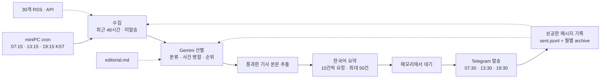

# AI Trend Bot

<p align="center">
  
</p>

AI 관련 소식을 선별해 짧은 한국어 요약과 원문 링크로 하루 세 번 보내는 개인용 Telegram 봇입니다.
[서비스 소개 페이지](docs/how-it-works.html)에서 수집 출처와 구조를 볼 수 있습니다.

## 구조



별도 서버·DB·후보 파일은 없습니다. 한 Python 프로세스가 준비와 발송을 맡습니다.
준비가 빨리 끝나면 정시까지 기다리고, 늦게 끝나면 즉시 발송합니다. 프로세스가 종료되면
준비한 후보는 사라지며, 다음 회차에서 피드에 남아 있는 항목을 다시 조회합니다.

| 모듈 | 역할 |
| --- | --- |
| `pipeline.py` | 수집 → 선별 → 본문 → 요약 → 대기 → 발송 조립 |
| `feeds.py` | RSS·Hacker News·Hugging Face 조회와 정규화 |
| `triage.py` | 분류·사건 병합·순위·상한 적용 |
| `gemini.py` | 선별·짧은 요약 프롬프트, 구조화 응답과 재시도 |
| `enrich.py` | trafilatura 본문 추출, 실패 시 RSS 티저 사용 |
| `scheduling.py` | 발송 목표 시각 선택과 정시 대기 |
| `telegram.py` | HTML 렌더링·안전한 메시지 분할·전송 |
| `store.py` | 월별 JSONL 기록과 전체 기록 조회 |
| `config.py` / `cli.py` | 설정 검증과 실행 명령 |

## 수집과 선별

- 총 **30개 출처**: 공식 9개, 연구 5개, 뉴스 매체 9개, 큐레이터·커뮤니티 7개입니다.
  GeekNews, The Decoder, Guardian AI를 추가했습니다. 전체 목록은 `config/sources.toml`에 있습니다.
- 게시일이 확인된 **최근 48시간** 기사와 미발송 URL을 먼저 고릅니다. 같은 URL은
  우선순위가 높은 출처를 남기고, 최신순으로 **출처별 상한을 나중에 적용**합니다.
- 날짜가 없거나 현재보다 5분 넘게 미래인 글은 게시일 오류 경고를 남기고,
  날짜가 확인된 최근 글 뒤에 후보로 넣습니다. 이런 글은 48시간 이내라고 확정하지 않습니다.
- 출처별 후보 상한 합계는 **435건**입니다. 피드가 제공하는 글 수에 따라 달라지며,
  실제 신규 기사 수나 발송량을 뜻하지 않습니다.
- Hacker News는 AI·LLM·OpenAI·Anthropic을 최근 48시간·최신순으로 각각 조회합니다.
  검색마다 최대 100개를 받아 URL 중복을 합칩니다. 과거 인기 글 위주의 검색은 쓰지 않습니다.
- Gemini는 100건씩 1차 선별합니다. 여러 배치가 있으면 생존자를 다시 함께 비교합니다.
  중복 사건은 대표 기사로 묶고 병합된 출처 URL은 내부 기록에 보존합니다.
- 최근 14일의 발송 사건과 대조하되, **새 가격·일정·결정·추가 피해처럼 새 사실이 있는 후속 보도**는
  남길 수 있습니다. 다른 회사의 독립적인 발표는 주제가 비슷해도 같은 사건으로 보지 않습니다.
- 모델 판정이므로 모든 사건 중복을 완벽하게 막지는 않습니다. 기준은 `config/editorial.md`에서 조정합니다.

선별한 기사만 본문을 가져옵니다. 요약은 짧은 제목과 모바일 2~3줄 분량을 목표로 한 사실 요약으로 요청하며,
관행적인 중요성·관련 대상 항목은 붙이지 않습니다. 입력에 없는 수치나 전망은 추측하지 않도록 요구합니다.
요약 요청은 **10건씩 순차 처리**합니다. 한 배치가 실패하면 준비가 완료되지 않은 브리핑은 발송하지 않습니다.

`--limit`은 기본·최대 **50건**입니다. 목표 건수가 아니므로 0건일 수도 있으며, 통과한 소식이 없으면 보내지 않습니다.

## 실행

```bash
uv sync --frozen
uv run ai-trend-bot check-config
uv run ai-trend-bot run --dry-run             # 발송·대기·기록 변경 없이 확인
uv run ai-trend-bot run --send                # 수동으로 즉시 발송
uv run ai-trend-bot run --send --scheduled --limit 50 --min-gap-hours 3
uv run ai-trend-bot archive-log               # 과거 기록만 월별로 이관, 발송 없음
```

`--scheduled`는 실행 시작 시 목표 발송 시각을 고정합니다. 목표보다 최대 30분 늦게 시작한 실행은
해당 회차를 즉시 준비하고, 그보다 늦으면 다음 회차를 선택합니다. 준비 완료 시각이 목표를 넘으면 바로 보냅니다.
수동 실행과 dry-run은 기본적으로 기다리지 않습니다. dry-run은 `--scheduled`를 주어도 기다리지 않습니다.

`TELEGRAM_BOT_TOKEN`, `TELEGRAM_CHAT_ID`, `GEMINI_API_KEY`가 필요합니다.
로컬은 `.env.example`을 `.env`로 복사해 설정합니다. miniPC는 저장소 밖의
`~/.config/ai-trend-bot.env`를 사용합니다. 키는 저장소나 소개 페이지에 포함하지 않습니다.
모델 기본값은 `gemini-3.1-flash-lite`이며 `GEMINI_MODEL`로 바꿀 수 있습니다.

## miniPC 운영

정규 회차는 발송 15분 전 준비를 시작합니다. Git 코드 갱신과 함께 아래 스크립트 사본·cron도 갱신해야 합니다.

| 위치 | 무엇 |
| --- | --- |
| `~/apps/ai-trend-bot` | 코드 clone. 실행 전 `git pull --ff-only` |
| `~/.config/ai-trend-bot.env` | 시크릿 (0600) |
| `~/bin/run-digest.sh` | `scripts/run-digest.sh` 설치 사본 |
| `~/.local/state/ai-trend-bot/` | 이번 달 기록, 월별 archive, 실행 잠금 |
| `~/logs/ai-trend-bot.log` | 회차 결과와 탈락 사유 |

새 코드가 운영 브랜치에 반영된 후 miniPC에서 스크립트를 다시 설치하고, 기존
`30 7,13,19` cron 한 줄을 아래 줄로 **교체**합니다. 시스템 시간대가 `Asia/Seoul`인 환경 기준입니다.

```bash
install -m 755 ~/apps/ai-trend-bot/scripts/run-digest.sh ~/bin/run-digest.sh
# crontab -e: 기존 줄 교체, 중복 추가하지 않음
15 7,13,19 * * * ~/bin/run-digest.sh >> ~/logs/ai-trend-bot.log 2>&1
```

스크립트는 Linux의 `flock`으로 겹친 실행을 막습니다. `--min-gap-hours 3`은 준비 전과
실제 발송 직전에 최근 발송을 확인해 중복 회차를 줄입니다. CLI를 직접 수동 실행할 때도
같은 보호가 필요하면 `--min-gap-hours 3`을 붙이세요.

GitHub Actions는 **수동 대체 실행**만 제공합니다. 정기 실행은 하지 않습니다.
Actions는 miniPC의 최신 발송 기록을 볼 수 없어 중복 브리핑을 보낼 수 있습니다.
수동 Actions 실행은 즉시 발송하며, 성공 기록과 월별 archive를 저장소에 커밋합니다.

## 데이터 저장

이번 달 발송 기록은 `sent.jsonl`에 추가하고, 한국 시간 기준 이전 달 기록은 삭제 없이 분리합니다.

```text
~/.local/state/ai-trend-bot/
├── sent.jsonl                         # 이번 달
└── archive/
    ├── until_2026-08-31.jsonl          # 8월 기록
    └── until_2026-09-30.jsonl          # 9월 기록이 있을 때 생성
```

새 달의 첫 발송 기록을 쓰기 전에 자동으로 분리합니다. 발송 없는 달에는 이관을 위해 별도 작업을
실행하지 않습니다. 필요하면 `archive-log` 명령으로 즉시 정리할 수 있습니다.
이름의 날짜는 해당 월의 마지막 날이며, JSON을 한 줄씩 기록하므로 확장자는 `.jsonl`입니다.
월별로 파일이 나뉘어도 **전체 기록 용량은 증가**합니다. 현재는 삭제·만료 정책을 두지 않습니다.

```jsonc
{"key":"<URL의 sha256>","title":"...","url":"...","source":"...","category":"...","event":"...","also":[["다른 매체","https://..."]],"sent_at":"..."}
```

경로는 `AI_TREND_BOT_SENT_LOG`로 정하며, 기본값은 `data/sent.jsonl`입니다.
저장소의 기존 스냅샷 178건은 `data/archive/until_2026-08-31.jsonl`에 내용 변경 없이 옮겼습니다.
실제 miniPC 기록은 저장소 밖에 있어 별도로 이관해야 합니다.

| 읽는 곳 | 범위 |
| --- | --- |
| `unseen()` | 이번 달·전체 archive의 URL 해시와 병합 출처 URL |
| `last_sent_at()` | 모든 기록의 최신 발송 시각 |
| `recent_events(days=14)` | 이번 달·archive 중 최근 14일의 사건 요지 |

이관은 archive를 먼저 원자적으로 쓰고 이번 달 파일을 교체합니다. 중간 실패 후 다시 실행해도
기록을 잃거나 중복으로 늘리지 않도록 처리합니다. Telegram 메시지별 전송 성공 뒤에만 기록하므로,
여러 메시지 중 일부만 전달됐다면 전달된 부분의 URL은 다음 회차에서 제외됩니다.
기사 본문·요약·수집 후보는 이 파일에 저장하지 않습니다.

탈락 항목과 사유는 회차 표준 출력에 남깁니다 (`--show-dropped`, 기본 켜짐).
실행 로그 파일의 보관은 발송 기록과 별개입니다.

## 브리핑 형식

아래는 형식 설명용 예시입니다.

```text
🌤️ AI 브리핑 · 10/4 (일) · 1건

01. [새 모델의 API 가격 인하]
입력 토큰 가격을 인하하고 새 요금제를 공개했습니다. 적용 범위와 시행일도 함께 안내했습니다.
원문: 공식 발표 외 1곳
```

헤더는 회차 이모지·날짜·요일·건수를 한 문단에 표시합니다. 화면 폭에 따라 자동 줄바꿈될 수 있습니다.
헤더 전체와 대괄호로 묶은 제목을 굵게 표시하고, 기사 사이 여백으로 구분합니다.
제목 바로 아래에 요약을 붙이며 분류와 긴 구분선은 표시하지 않습니다.
원문은 대표 기사 링크 하나와 `외 N곳`으로 표시합니다. 같은 매체의 여러 기사는 한 곳으로 계산하며,
다른 출처 URL은 내부 발송 기록에 그대로 보존합니다. 여러 메시지로 나뉘면 `(1/3)`처럼 순서를
일반 굵기로 붙입니다.
HTML 문자열 기준 3,800자 안에서 기사 단위로 분할합니다. 과도하게 긴 요약은 텍스트를 먼저 줄이고
이스케이프해 링크·태그를 중간에서 자르지 않습니다.

## 오류와 점검

```bash
ssh miniPC 'tail -30 ~/logs/ai-trend-bot.log'
```

피드 오류는 그 출처만 건너뜁니다. 원문 추출 실패는 티저로 대체합니다.
Gemini의 일시적인 429·5xx는 재시도하며, 끝내 실패하면 해당 회차를 보내지 않습니다.
miniPC가 내려가면 정규 발송도 없습니다. 다음 회차에서 **피드에 남아 있고 최근 48시간 기준을
만족하는** 미발송 기사는 다시 후보가 됩니다. 모든 기사의 복구를 보장하지는 않습니다.

Threads @choi.openai는 공용 RSSHub 경유 피드가 설정되어 있으나 현재 조회가 실패합니다.
복구를 위해 추가 서버나 인증 절차를 만들지는 않습니다. 해당 소스가 실패해도 나머지는 진행합니다.
공식 Threads API 클라이언트는 코드에 남아 있지만 현재 파이프라인에서 호출하지 않습니다.

## 검증

```bash
uv run --frozen pytest -q
uv run --frozen ruff check .
uv run --frozen basedpyright
bash -n scripts/run-digest.sh
```

설계와 실행 범위는 [2026-10-04 설계 문서](docs/superpowers/specs/2026-10-04-briefing-refresh-design.md)에 정리했습니다.

## 변경 이력

| 날짜 | 무엇이 | 왜 |
| --- | --- | --- |
| 2026-08-01 | 첫 동작 — RSS 수집 → Gemini 요약 → 텔레그램. GitHub Actions 예약 | |
| 2026-08-03 | **선별 계층 도입.** 4단 파이프라인으로 재구성, `config/editorial.md` 신설, 수집처 8 → 27개 | RSS 티저를 요약해 "요약본의 요약"이 나왔고, 중요도 판단 없이 최신순으로만 잘랐다 |
| 2026-08-04 | 2차 선별을 재심사가 아니라 **"오늘 실을 것 고르기"**로 재정의 | 같은 질문을 두 번 하니 1차 통과분이 거의 전부 재승인돼 상한 30건에 붙었다 |
| 2026-08-05 | 백업 실행에 `--min-gap-hours` 가드. 프롬프트의 건수 상수를 빼고 볼륨 조절을 `editorial.md`로 이관 | 후보는 "새로 올라온 것"이 아니라 **"아직 안 보낸 것 전부"**라 백업이 매번 2차 브리핑을 보냈다. 프롬프트에 박은 "3~8건"은 편집 기준 위에서 할당량으로 작동했다 |
| 2026-08-07 | **실행을 miniPC cron으로 이관.** `schedule:` 삭제, `AI_TREND_BOT_SENT_LOG`로 상태 파일 분리 | Actions `schedule`이 +63~193분 지연시키거나 아예 폐기했다. 아침 브리핑이 점심에 오는 게 정상 상태였다 |
| 2026-08-08 | 탈락 목록을 발송 회차에도 로그에 기록 | 드라이런은 두 시간 뒤면 다른 후보 집합을 본다. "이 브리핑이 무엇을 버렸는가"는 그 회차만 답할 수 있다 |

| 2026-10-04 | 30개 출처·48시간 미발송 필터·짧은 요약·최대 50건·15분 전 준비·월별 기록 | 신규 글 누락과 읽는 부담을 줄이고, 기록을 삭제하지 않고 분리 |
