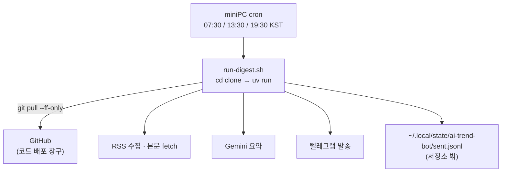

# AI 트렌드 봇 — miniPC 실행 이관 설계

작성일: 2026-08-07
상태: 2026-08-07 구현 완료. 실측값은 7장에 반영.

## 1. 배경

브리핑이 목표 시각에 오지 않는다. 실행 자체는 정상이고 1분 20초면 끝난다. 밀리는 것은 전부
GitHub이 `schedule` 이벤트를 던져 주기까지의 큐 대기다.

2026-08-05 ~ 08-07 실제 발송 이력이다. 목표는 Asia/Seoul 07:23 / 13:23 / 19:23이었다.

| 목표 (KST) | 실제 도착 (KST) | 밀림 |
| --- | --- | --- |
| 07:23 | 08:26 | +63분 |
| 13:23 | 16:08 | +165분 |
| 19:23 | 21:20 | +117분 |
| 07:23 | 10:36 | +193분 |

아침 브리핑이 점심때 오고 낮 브리핑이 저녁에 온다. 08-06 밤에는 예약 두 개(22:23, 23:11 UTC)가
실행 자체가 걸리지 않고 폐기됐다.

`schedule`은 보장이 아니라 best-effort 큐다. 무료 티어 + 비공개 저장소는 우선순위가 낮다.
**무료 티어의 분(minutes) 한도 문제가 아니다.** 현재 사용량은 월 약 165분이고 한도는 2000분이다.

## 2. 목표와 비목표

### 목표

- 브리핑이 Asia/Seoul **07:30 / 13:30 / 19:30**에 도착한다. 오차는 실행 시간(약 90초) 이내.
- **정시성이 GitHub의 어떤 큐에도 의존하지 않는다.**
- 중복 발송이 없다.
- miniPC를 실제 워크로드 운영 사례로 남긴다.

### 비목표

- **Docker / Kubernetes를 쓰지 않는다.** 상시 실행 프로세스가 없어 격리할 대상이 없다.
- **DB, 웹 프레임워크, 배치 프레임워크를 쓰지 않는다.** 2분짜리 CLI 한 번 호출이다.
- **GitHub Actions self-hosted 러너를 쓰지 않는다.** 3.3 참고.
- **호스트에 파이썬을 직접 설치하지 않는다.** `uv`가 3.13을 받아온다.
- **발송 실패 알림 장치를 만들지 않는다.** 브리핑이 안 오는 것이 곧 알림이다.

## 3. 왜 이 형태인가

정시성과 실행 위치는 별개 축이다. 지연은 **트리거 축**에서 발생한다. 네 조합을 비교했다.

| | 트리거 | 실행 | 정시성이 의존하는 것 | miniPC 시크릿 | `sent.jsonl` |
| --- | --- | --- | --- | --- | --- |
| A | miniPC cron → `workflow_dispatch` | GitHub hosted | **GitHub 러너 배정 (미검증)** | PAT 1개 | 현행 유지 |
| B | GitHub `schedule` | miniPC 러너 | **미해결** | 0개 | 현행 유지 |
| C | miniPC cron → `workflow_dispatch` | miniPC 러너 | GitHub 잡 배정 (미검증) | PAT 1개 | 현행 유지 |
| **E** | **miniPC cron** | **miniPC 호스트** | **miniPC cron 만** | 3개 | 저장소 밖으로 |
| D | k3s CronJob | miniPC Pod | miniPC k3s 만 | 3개 | **새로 설계 필요** |

**B는 탈락이다.** 지연은 러너가 아니라 이벤트 계층에서 발생하므로 러너를 바꿔도 아무것도 안 고쳐진다.

**A와 C는 검증되지 않은 가정 위에 선다.** `workflow_dispatch`가 `schedule` 큐를 타지 않는 것은
맞지만, 워크플로가 생성된 뒤 러너를 배정받는 큐는 여전히 GitHub 것이다. 이 지연을 실측하려 했으나
**GitHub API로는 측정이 불가능하다** — `created_at`과 `run_started_at`이 모든 실행에서 동일하다.
GitHub은 큐 대기가 끝나고 실행이 생성될 때 `created_at`을 찍기 때문이다. 목표가 "정시에 문제없이"인데
임계 경로에 측정 불가능한 남의 큐를 남길 이유가 없다.

**D도 탈락이다.** 정시성 이득이 E와 같은데, Pod는 실행 후 사라지므로 `data/sent.jsonl` 중복 방지
상태를 어디에 둘지(PVC 또는 git push용 PAT) 새로 설계해야 한다. 로그도 휘발한다. 얻는 것은
k8s 매니페스트 한 벌인데, jay-wiki에 이미 k3s 운영 사례가 여러 편 있다.

**E를 택한다.** 정시성이 miniPC의 cron 하나에만 의존한다. D의 비용(상태 재설계)은 저장소를 clone해
쓰는 것으로 사라지고, A의 리스크(측정 불가능한 남의 큐, PAT 만료)도 없다.

### 3.1 무엇을 잃는가

**GitHub 예약을 백업으로 남길 수 없다.** Actions가 계속 예약 실행되면 저장소 안의
`data/sent.jsonl`(더 이상 miniPC의 발송 기록을 받지 않는다)을 기준으로 판단해 같은 브리핑을 한 번 더
보낸다. 그래서 `schedule:` 블록을 지운다.

결과적으로 **miniPC가 죽으면 브리핑이 아예 오지 않는다.** A안은 "늦게라도 온다"였으므로 이것이
E의 유일한 실질 손실이다. 받아들인다 — 브리핑 부재 자체가 알림 역할을 한다.

### 3.2 상태 파일이 유일한 git 결합점이었다

`ai_trend_bot/cli.py:23`이 상태 경로를 저장소 안에 하드코딩한다.

```python
SENT_LOG_PATH: Final = Path("data/sent.jsonl")
```

clone해서 그대로 돌리면 매 실행이 이 추적 파일을 수정하고, 이후 `git pull`이 로컬 변경으로 막힌다.
`git push`로 되돌리려면 PAT이 필요해져 A안의 리스크가 되살아난다.

경로를 환경변수로 뺀다. 기본값이 그대로이므로 GitHub Actions 쪽 동작은 바뀌지 않는다.

```python
def sent_log_path() -> Path:
    """Where the send log lives. Overridable so a read-only clone can keep state elsewhere."""
    override = os.environ.get("AI_TREND_BOT_SENT_LOG")
    return Path(override) if override else SENT_LOG_PATH
```

**상수에 값을 박지 않고 함수로 감싼 이유**는 모듈 상수가 import 시점에 한 번만 평가되기
때문이다. 그러면 테스트가 `monkeypatch.setenv`로 검증할 수 없고, 한 세션 안에서 먼저 import한
테스트가 뒤의 테스트를 오염시킨다. 이름을 `_sent_log_path`에서 공개 이름으로 바꾼 것은
basedpyright가 테스트의 private import를 `reportPrivateUsage`로 잡았기 때문이다.

이것으로 **저장소가 읽기 전용이 되고 PAT이 아예 필요 없어진다.**

### 3.3 self-hosted 러너를 검토했으나 쓰지 않는다

C를 검토하며 확인한 사실이므로 기록한다. 여러 저장소가 self-hosted 러너를 공유하려면 조직 또는
엔터프라이즈 레벨에 등록해야 하는데, `jaymunsh`는 Organization이 아니라 **User** 계정이다
(`gh api users/jaymunsh --jq .type` → `User`). 러너는 저장소 단위로만 붙는다.

miniPC의 기존 러너 `jaypc`(labels: `self-hosted, Linux, X64, minipc`)는 `jaymunsh/jay-wiki`에 묶여 있고
`jaymunsh/ai-trend-bot`의 등록 러너는 0개다. C를 하려면 전용 러너를 하나 더 등록해야 한다.
E는 러너 자체가 필요 없으므로 이 비용이 발생하지 않는다.

## 4. 구조



GitHub은 코드를 받아오는 창구로만 남는다. 발송 경로에 GitHub이 없다.

## 5. 변경 범위

| 어디 | 무엇 |
| --- | --- |
| `ai_trend_bot/cli.py` | `sent_log_path()` 추가, 호출부 2곳 교체. 3.2 |
| `.github/workflows/digest.yml` | `schedule:` 블록(6줄) 삭제. `workflow_dispatch:`는 유지 |
| `scripts/run-digest.sh` | 신규. 실행 스크립트 정본 |
| `README.md` | 실행 주체가 miniPC임을 반영 |
| `docs/server-trigger-handoff.md` | 삭제. A안 전제로 쓰여 있어 폐기한다 |
| miniPC | clone, `uv`, 시크릿 파일, 스크립트 사본, crontab 3줄 |

### 5.1 `digest.yml`에서 `schedule:`을 지운다

`workflow_dispatch:`는 남긴다. miniPC가 죽었을 때 사람이 수동으로 돌리는 창구다. 이 경우
Actions는 저장소 안의 `data/sent.jsonl`을 보므로 miniPC의 최근 발송을 모르고, `--min-gap-hours`가
막지 못해 중복이 갈 수 있다. **수동 실행은 그것을 감수하고 누르는 것이다.**

`concurrency` 블록과 `Commit send log` 스텝은 그대로 둔다. 수동 실행 시에는 여전히 유효하다.

### 5.2 `--min-gap-hours`는 3을 유지한다

A안에서는 이 값을 5로 올려야 했다. GitHub 예약분이 최대 +193분 지연으로 도착해 3시간 갭을 넘기면
중복이 가기 때문이었다. E에서는 예약 자체를 지우므로 **지연 도착이 존재하지 않는다.** 3으로 둔다.

miniPC cron이 어떤 이유로 두 번 발사되는 경우(수동 테스트 등)를 여전히 3시간 갭이 막는다.

## 6. 파일

### 6.1 저장소

```
ai-trend-bot/
├── .github/workflows/digest.yml               수정
├── ai_trend_bot/cli.py                        수정
├── scripts/
│   └── run-digest.sh                          신규
└── docs/
    ├── server-trigger-handoff.md              삭제
    └── superpowers/specs/
        └── 2026-08-07-minipc-execution-design.md
```

스크립트를 저장소에 두는 이유는 miniPC가 날아가도 재구축이 복사 한 번이 되기 때문이다.

### 6.2 miniPC

```
~/apps/ai-trend-bot/                    git clone. 읽기 전용
~/.ssh/ai-trend-bot                     read-only deploy key
~/.config/ai-trend-bot.env              0600. 시크릿 3개
~/bin/run-digest.sh                     0755. 저장소 사본
~/.local/state/ai-trend-bot/sent.jsonl  중복 방지 상태
~/logs/ai-trend-bot.log                 실행마다 결과 한 줄
```

비공개 저장소 clone에는 인증이 필요하다. 계정 전체에 권한이 붙는 PAT 대신 **저장소 하나에만
붙는 read-only deploy key**를 쓴다. `Allow write access`를 주지 않으므로 miniPC에서 push가
구조적으로 불가능하고, 만료가 없어 A안의 PAT 만료 리스크가 생기지 않는다. miniPC에는 jay-wiki
러너도 있으므로 `~/.ssh/config`에 호스트 별칭을 따로 둬 키가 섞이지 않게 한다.

코드 갱신을 rsync로 하는 방법도 검토했다. deploy key가 필요 없어지는 대신 `git pull`이 사라져
**갱신이 자동에서 수동으로 바뀌고, 박스 위 코드가 어느 시점 것인지 알 수 없게 된다.**
`config/editorial.md` 튜닝이 반복 작업이라 "머지하면 다음 회차부터 반영"을 택했다.

시크릿을 clone 안의 `.env`가 아니라 `~/.config`에 두는 이유는, `.gitignore`에 걸려 있더라도
저장소 디렉터리 밖에 두는 편이 실수로 커밋될 여지를 없애기 때문이다. `pydantic-settings`는
`.env` 파일과 환경변수를 모두 읽으므로 export만 하면 동작한다(`ai_trend_bot/config.py:87` `RuntimeSecrets`).

시크릿 세 개는 `TELEGRAM_BOT_TOKEN`, `TELEGRAM_CHAT_ID`, `GEMINI_API_KEY`다.

상태 디렉터리는 미리 만들 필요가 없다. `SentLog.mark`가 쓰기 직전에
`parent.mkdir(parents=True, exist_ok=True)`를 부른다(`ai_trend_bot/store.py:64`).

### 6.2.1 첫 실행 전에 기존 상태를 옮긴다

**이 단계를 빠뜨리면 첫 실행이 대량 중복 발송을 만든다.** `SentLog.unseen`은 상태 파일에 없는 키를
전부 "아직 안 보낸 것"으로 판단한다(`ai_trend_bot/store.py:39`). 빈 파일로 시작하면 최근 RSS 항목이
모두 미발송으로 보여 이미 보낸 브리핑이 통째로 다시 간다.

clone 안의 기존 기록을 그대로 복사해서 시작한다.

```bash
mkdir -p ~/.local/state/ai-trend-bot
cp ~/apps/ai-trend-bot/data/sent.jsonl ~/.local/state/ai-trend-bot/sent.jsonl
```

이후 저장소의 `data/sent.jsonl`은 갱신이 멈추고 이관 시점의 스냅샷으로 남는다. 수동
`workflow_dispatch`가 보는 것이 이 스냅샷이며, 5.1의 중복 위험이 여기서 나온다.

### 6.2.2 저장되는 것은 이 파일 하나뿐이다

DB도 캐시도 없다. RSS로 받은 항목과 Gemini 요약은 텔레그램으로 나가고 버려진다. 남는 상태는
append-only JSONL 한 줄씩이다.

```json
{"key":"...","title":"...","url":"...","source":"...","category":"...","event":"...","sent_at":"..."}
```

세 곳에서 읽는다. **단순 중복 방지 로그가 아니라 요약 품질에도 물려 있다.**

| 읽는 곳 | 쓰는 범위 | 없으면 |
| --- | --- | --- |
| `unseen()` (`store.py:39`) | 전 기간의 `key` | 이미 보낸 항목을 다시 보낸다 |
| `last_sent_at()` (`store.py:42`) | 마지막 1줄 | 회차 중복 방지가 풀린다 |
| `recent_events(days=14)` (`store.py:54`) | 최근 14일의 `event` | triage가 후속 보도를 새 소식으로 착각한다 |

크기는 `origin/main` 167줄 68KB 기준 실측이다. 줄당 407B, 정상 회차 평균 7.9줄 × 하루 3회 =
**24줄/일 ≈ 9.4KB/일 ≈ 연 3.4MB**.

가지치기가 없어 무한히 자란다. `_records()`가 호출마다 파일 전체를 파싱하고 실행당 세 번 불린다.
5년이면 약 17MB / 4만 줄이며 파싱은 여전히 1초 안쪽이다.
<!-- ponytail: 무한 증가하는 append-only 로그. 파싱이 느려지면 90일 이전 줄을 잘라내는 것으로 충분하다 -->

**백업은 두지 않는다.** 이 파일이 날아가면 (1) 다음 실행이 최근 항목을 미발송으로 보고 브리핑을
한 번 크게 보내고, (2) 2주간 triage 맥락이 빈다. **둘 다 자가 복구된다** — 한 번 보내고 나면
다시 채워지고 14일이면 맥락도 돌아온다. 최악이 "중복 브리핑 한 번 + 어중간한 2주"라 백업 장치의
값을 못 한다.
<!-- ponytail: 상태 백업 없음. 아쉬우면 주 1회 cp 크론 한 줄 -->

### 6.3 실행 스크립트

```bash
#!/usr/bin/env bash
set -euo pipefail

REPO=~/apps/ai-trend-bot
export AI_TREND_BOT_SENT_LOG=~/.local/state/ai-trend-bot/sent.jsonl

set -a; source ~/.config/ai-trend-bot.env; set +a

cd "$REPO"
git pull --ff-only --quiet || echo "$(date -Is) git pull 실패, 기존 코드로 진행"
~/.local/bin/uv sync --frozen --quiet
~/.local/bin/uv run ai-trend-bot run --send --limit 30 --min-gap-hours 3
echo "$(date -Is) done"
```

**`cd "$REPO"`가 필수다.** `config/sources.toml`, `config/editorial.md`가 CWD 상대 경로로 열린다
(`ai_trend_bot/cli.py:22,24`). cron은 홈 디렉터리에서 시작하므로 `cd` 없이는 설정 파일을 못 찾는다.

`git pull` 실패는 치명적이지 않다. 네트워크 문제로 못 당겨도 기존 코드로 발송하는 편이 낫다.

`uv`를 절대 경로로 쓰는 것은 cron의 빈약한 `PATH` 때문이다.

### 6.4 crontab

**설치 시 `timedatectl`로 서버 타임존을 먼저 확인하고 한 줄을 고른다.**

```bash
# 서버가 KST인 경우
30 7,13,19 * * * ~/bin/run-digest.sh >> ~/logs/ai-trend-bot.log 2>&1

# 서버가 UTC인 경우 (KST = UTC+9)
30 22,4,10 * * * ~/bin/run-digest.sh >> ~/logs/ai-trend-bot.log 2>&1
```

cron이 07:30에 시작하면 도착은 약 07:32다. 도착을 07:30에 맞추려면 분을 28로 당긴다.

## 7. 리소스

miniPC가 실제로 부담하는 양이다. 상시 프로세스는 없다.

| 항목 | 값 | 근거 |
| --- | --- | --- |
| 상시 CPU / RAM | 0 | cron이 시각에만 프로세스를 띄운다 |
| 실행 시간 | **80초** × 3회/일 | `/usr/bin/time -v` 실측 (1:19.76) |
| 실행 시 CPU | **5%** | 같은 실측. 대부분 RSS·Gemini 응답 대기(I/O) |
| 실행 시 RAM | **96MB** | 같은 실측 (maximum resident set size 96032KB) |
| 디스크 | **436MB** | `du -sh`: clone+venv 423MB, `uv` 캐시 13MB |
| 상태 파일 증가 | 연 약 3.4MB | 실측 407B/줄 × 24줄/일. 6.2.2 |
| 로그 증가 | 연 약 40KB | 실행당 1~2줄. 로테이션 불필요 |

2026-08-07 miniPC(8코어)에서 `--dry-run`으로 측정했다. 실제 발송분은 텔레그램 요청 몇 건이
더해질 뿐이라 차이가 없다.

**RAM을 3배 넘게 과대추정했었다.** `trafilatura`/`lxml`을 무겁게 봤는데, 본문 fetch가 선별을
통과한 소수에만 걸려서 한 번에 들고 있는 문서가 적다. k3s와 OpenSearch가 이미 도는 기계에서
무시할 수준이다.

## 8. 실패 모드

| 증상 | 원인 | 결과 |
| --- | --- | --- |
| 로그 파일이 비어 있음 | cron의 `PATH`. 6.3이 절대 경로로 대응 | 발송 없음 |
| `설정 파일을 찾을 수 없음` | `cd "$REPO"` 누락 | 발송 없음 |
| 텔레그램 HTTP 401 | 봇 토큰 오기입 | 발송 없음, 로그에 남음 |
| Gemini HTTP 429/5xx | 레이트리밋·장애 | `외부 API 오류`로 exit 1, 로그에 남음 |
| 실행됐는데 텔레그램 조용함 | 편집 기준 통과 항목 0건. 정상 동작 | 로그에 "기준을 통과한 항목이 없습니다" |
| 브리핑이 두 번 옴 | 수동 `workflow_dispatch`를 눌렀다 | 5.1의 알려진 한계 |
| miniPC 다운 / 재부팅 | — | **그 회차는 오지 않는다.** 3.1의 감수한 손실 |
| 상태 파일 소실 | 디스크 문제 등 | 중복 브리핑 1회 + 2주간 triage 맥락 공백. 자가 복구된다. 6.2.2 |
| **첫 실행에 브리핑이 대량으로 옴** | 6.2.1의 상태 복사를 빠뜨렸다 | 상태 파일이 비어 최근 항목이 전부 미발송으로 보였다 |

## 9. 검증

구축 직후, 발송 없이 파이프라인만 확인한다.

```bash
cd ~/apps/ai-trend-bot && set -a; source ~/.config/ai-trend-bot.env; set +a
AI_TREND_BOT_SENT_LOG=~/.local/state/ai-trend-bot/sent.jsonl ~/.local/bin/uv run ai-trend-bot run --dry-run
```

`--dry-run`은 `_sent_within` 검사를 건너뛰고 텔레그램으로 보내지 않는다(`ai_trend_bot/cli.py:75`).
수집·요약·편집 기준이 다 도는지 여기서 본다.

그다음 실제 발송을 한 번 한다.

```bash
~/bin/run-digest.sh; echo "exit=$?"
```

텔레그램에 도착하면 성공이다. 직후 다시 돌리면 "최근 3시간 안에 발송한 기록이 있어 건너뜁니다"가
남고 아무것도 오지 않는다. 이것도 정상이다.

며칠간의 성공 기준:

- 텔레그램 도착 시각이 **07:3x / 13:3x / 19:3x**로 고정된다.
- `~/logs/ai-trend-bot.log`에 하루 3회 `done`이 남는다.
- GitHub Actions에 `event=schedule` 실행이 하나도 생기지 않는다.

## 10. 이후

- ~~설치 후 RAM·디스크를 실측해 7장 표를 갱신한다.~~ 2026-08-07 완료. 7장 참고.
- 며칠 관측해 전후 비교 수치를 모은다. **첫 자동 실행은 2026-08-08 07:30이다** —
  이관 당일 18:33에 수동으로 한 번 보냈으므로 08-07 19:30 회차는 `min-gap 3`에 걸려 건너뛴다.
- 블로그 글은 **이 spec의 범위 밖이다.** 결과 수치가 나온 뒤 `visualStudy` 저장소에
  `blog/drafts/<slug>.md`로 별도 작성한다(카테고리: 개인 프로젝트). 지금 쓰면 고정되지 않은 수치를
  본문에 박게 된다.

## 11. 참고

- 저장소: `https://github.com/jaymunsh/ai-trend-bot` (비공개)
- 중복 방지 구현: `ai_trend_bot/cli.py:113` `_sent_within`
- 시크릿 로딩: `ai_trend_bot/config.py:87` `RuntimeSecrets`
- 예약 실행이 왜 신뢰할 수 없는지: `docs/superpowers/specs/2026-08-03-digest-quality-overhaul-design.md` 18장
